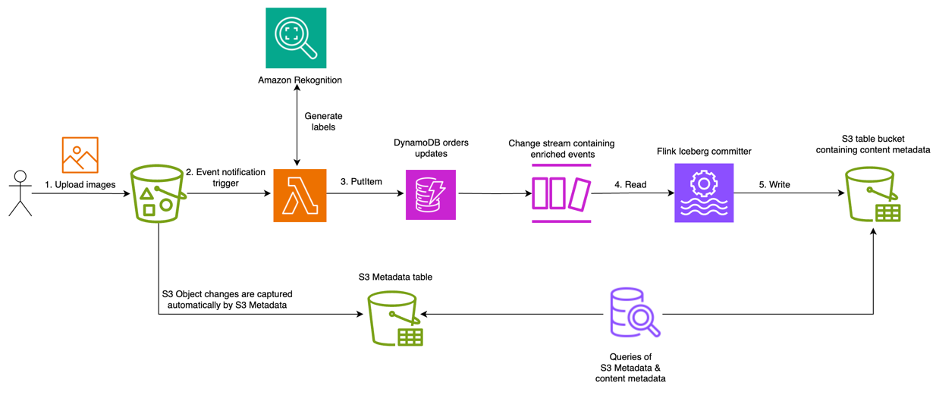

# Example of building an Iceberg table containing metadata about S3 Objects' content 

This package provides an example, and some sample code, showing how to build a pipeline for extracting and storing
metadata about the content of objects stored in S3 as they're uploaded.  It consists of two modules, one running as 
Lambda functions that respond to S3 Event Notifications and extract metadata about the content of images being
uploaded.  This module contains two example implementations for this extraction: the first inspects the EXIF metadata 
of the image and the second instructs Amazon Rekognition to detect labels.  The second module consists of an Apache 
Flink application, hosted by Amazon Managed Service for Apache Flink, that consumes the enriched events and writes them
to an Iceberg table hosted in S3 Table Buckets.

This example serves to demonstrate how you might build an application to enrich and join with the metadata provided by 
the S3 Metadata feature.

### Sample code notes

The sample code; software libraries; command line tools; proofs of concept; templates; or other related technology 
(including any of the foregoing that are provided by our personnel) is provided to you as AWS Content under the AWS 
Customer Agreement, or the relevant written agreement between you and AWS (whichever applies). You should not use 
this AWS Content in your production accounts, or on production or other critical data. You are responsible for 
testing, securing, and optimizing the AWS Content, such as sample code, as appropriate for production grade use 
based on your specific quality control practices and standards. Deploying AWS Content may incur AWS charges for 
creating or using AWS chargeable resources, such as running Amazon EC2 instances or using Amazon S3 storage.

# Overview
At a very high level, this sample builds a stream of 'enriched' S3 Object events and writes those events to a 
materialized view representing the buckets contents.  The view, or table, contains a record for every object in the 
bucket, along with some metadata describing the content of the object.  As written, the metadata extraction works only 
for images, but could be extended to work with any file type.  It also currently assumes a 1:1 relationship between an
object (or object version) and record in the table.

For example, given a bucket with 3 images in it: cat.jpg, dog.jpg, and hamster.jpg, we'd expect a table that looks 
notionally like:

| Bucket | Key         | Sequencer | Labels                  |
| - |-------------|------------|-------------------------| 
| example_bucket | cat.jpg     | 723                     | [Cat, Animal, Indoors]  |
| example_bucket | dog.jpg     | 337                     | [Dog, Animal, Outdoors] |
| example_bucket | hamster.jpg | 423                     | [Hamster, Animal, Cage] |

The following diagram illustrates the high-level architecture of the solution.



Images uploaded to the bucket trigger Lambda functions that extract the metadata of the image content.  This metadata is
written to a DynamoDB table using conditional writes to prevent duplicate processing and handle out-of-order arrival of
events.  Finally, a Flink application consumes the DDB Change Stream and upserts the events into an Iceberg Table 
in an S3 Tables bucket.

## Metadata Extraction
The sample ships with two examples of metadata extraction.  The first downloads the images and extracts the exif 
metadata and some basic attributes about the image itself like height and width.  The second makes a request to 
Amazon Rekognition to detect labels for the image.  The metadata returned by these extraction classes is merged and 
passed through to the DynamoDB table.

## Event Ordering
S3 Event Notifications can be duplicated and arrive out of order, e.g. the event for a DELETE operation on a key can 
arrive, and be processed, before the event for the preceding PUT operation on the same key.  If we allowed these
events to be written to the table in their arrival order, our table would be forever out of sync with the content of the
bucket.  To solve this issue, we use a DynamoDB table to ensure that events are processed in order. It may be possible 
to configure or modify the Flink application to handle this, potentially unbounded-out-of-orderness, which would remove
the need for the DDB Table, and it can be replaced with a queue or other streaming platform like MSK.

## Iceberg Writing
Apache Flink is used to write the enriched event stream to an Iceberg table stored in an S3 Table Bucket.  The 
primary key for the table is formed from the bucket, key, and version id of the object. Records are 'upserted' into 
the table, replacing any existing record by primary key.

## Joining With S3 Metadata
Assuming you've enabled S3 Metadata on the input bucket, we would expect to see two tables in our S3 Table Bucket.
<table>
<tr><th>S3 Metadata </th><th>Content Metadata</th></tr>
<tr style="vertical-align: top"><td>

| Column Name  | Data Type      |
|--------------|----------------|
| bucket       | string         |
| key          | string         |
| versionId    | string         |
| sequencer    | string         |
| etag         | string         |
| metadata     | string         |
| lastModified | timestamp_ntz  |
| labels       | array\<string> |
| image_width  | int            |
| image_height | int            |

</td><td>

| Column Name           | Data Type           |
|-----------------------|---------------------|
| bucket                | string              |
| key                   | string              |
| sequence_number       | string              |
| record_type           | string              |
| record_timestamp      | timestamp_ntz       |
| version_id            | string              |
| is_delete_marker      | boolean             |
| size                  | bigint              |
| last_modified_date    | timestamp_ntz       |
| e_tag                 | string              |
| storage_class         | string              |
| is_multipart          | boolean             |
| encryption_status     | string              |
| is_bucket_key_enabled | boolean             |
| kms_key_arn           | string              |
| checksum_algorithm    | string              |
| object_tags           | map\<string,string> |
| user_metadata         | map\<string,string> |
| requester             | string              |
| source_ip_address     | string              |
| request_id            | string              |

</td></tr> </table>

The S3 Metadata table represents an append-only log of the mutating operations performed on the input bucket, while 
the Content Metadata table presents a near-real-time view of the current contents of the bucket.  Joins between these 
two tables have to take into account that one or other (or both) may be out of date / sync with one another.

To get started, we'll create a view of the S3 Metadata table that 'coalesces' the log into a view of the current 
state of the bucket:

```sql
CREATE TEMPORARY VIEW s3_metadata_coalesced AS (
WITH cte as (
    -- start with a common table expression which can narrow down the records of interest.
    -- e.g. only those with a certain prefix. Note that this table name is defined when we enable S3 Metadata, the 
    -- example here assumes you've used the sample configuration.
    SELECT * 
    FROM catalog.aws_s3_metadata.mdblogs3metadata
    WHERE 1 = 1
),
version_stacks as (
   SELECT *,
          -- introduce a column called 'next_sequence_number' which is the next larger
          -- sequence_number for the same (key, version_id), in sorted order.
          LEAD(sequence_number, 1) over (
             -- partitioning by bucket will become necessary when multiple source buckets
             -- are mingled in the same table. it could be omitted for now.
             partition by (bucket, key, version_id) order by sequence_number ASC
          ) as next_sequence_number
   from cte
),
-- Pick the 'tip' of each version stack triple: (bucket, key, version_id).
-- The tip of the version stack is the row of that triple with the largest sequencer.
-- 
-- Selecting only the tip will necessarily filter out any row duplicates
-- (e.g. this is not the norm, but some events can be delivered more than once to the table).
-- but will include rows that may no longer exist in the bucket (i.e. because the
-- journal table contains rows for both extant and extinct objects).
latest_versions as (
    SELECT * from version_stacks where next_sequence_number is NULL
),
-- We can eliminate the rows which are extinct from the bucket, by filtering by
-- row type. An object version has been deleted from the bucket if its tip a
-- row_type==DELETE
extant_versions as (
    SELECT * from latest_versions where record_type != 'DELETE'
),
-- Optional: If you are interested in quickly determining which of several object
-- versions is 'latest', you can compare their sequence numbers. A version_id is the
-- latest if its tip's sequence_number is the largest amongst all other tips in the same key.
with_is_latest as (
    SELECT *,
           -- is the sequence_number of this row the same as the largest sequencer for that key? (that still exists)
           sequence_number = (MAX(sequence_number) over (partition by (bucket, key))) as is_latest_version
    FROM extant_versions
)
SELECT * from with_is_latest
ORDER BY bucket, key, sequence_number
)
```

We can exercise this view with something like:
```sql
SELECT bucket, key, size, storage_class, object_tags
  FROM s3_metadata_coalesced
```
And get a result like:

|key                          |size   |storage_class| object_tags  |
|-----------------------------|-------|-------------|--------------|
|20240724_123107.jpg          |5983132|STANDARD     | {foo -> bar} |
|20240810_190945.jpg          |2067312|STANDARD     | {}           |
|20240811_143126.jpg          |3178353|STANDARD     | {}           |

And finally we can join the two tables:

```sql
   SELECT om.key, size, storage_class, object_tags, labels
     FROM s3_metadata_coalesced as om
LEFT JOIN catalog.default.s3_content_metadata as cm
       ON om.bucket = cm.bucket
      AND om.key = cm.key
      AND om.e_tag = cm.etag
```
And get a result:

|key                          | size    |storage_class| object_tags  |labels                                      |
|-----------------------------|---------|-------------|--------------|--------------------------------------------|
|20240724_123107.jpg          | 5983132 |STANDARD     | {foo -> bar} |[Pond, Bird, Waterfowl]                     |
|20240810_190945.jpg          | 2067312 |STANDARD     | {}           |[Airport, Truck, Person]                    |
|20240811_143126.jpg          | 3178353 |STANDARD     | {}           |[Land, Outdoors, Sea]                       |

### Accessing other extracted metadata
The sample includes all metadata in the table as extracted and provided by the Lambda functions.  This metadata can 
be queried as a JSON blob using the JSON related functions in the query engine.  For example:

```sql
SELECT   key
       , labels
       , get_json_object(metadata, '$.exif.Model') as Model
       , get_json_object(metadata, '$.exif.Make') as Make
  FROM catalog.default.s3_content_metadata
```
And get a result:

|key                |labels                  |Model   |Make   |
|-------------------|------------------------|--------|-------|
|20240810_190945.jpg|[Airport, Truck, Person]|SM-G998B|samsung|

### Considerations when joining with the S3 Metadata table
#### Latent events
S3 Metadata will update the table according to the volume of collected transactions in a batching window. This can 
mean that for low volume buckets, the table may be a few minutes behind the latest mutations performed on the 
bucket.  The same is true for the content metadata table written by Flink, though you can control this by modifying 
the checkpointing interval in the Flink app's configuration (currently set to 60 seconds).  Note that this window 
needs to be balanced with the rate of incoming events. 

This inherent latency in both tables means that we may see incomplete or missing records for some objects very recently 
created or modified in the bucket.  Depending on the type of join then we might see inconsistencies in the results 
for these objects.

#### Event Sequence & Content Validation
Despite the similarity in name and purpose, the `sequencer` field in S3 Event Notifications cannot be compared to the 
`sequence_number` in S3 Metadata tables.  This usually isn't going to present a problem, but in tables with high 
levels of concurrent mutations to specific keys in un-versioned buckets we may get inconsistent results from joins.  

Consider the following scenario:
1. At time T, a cat picture is uploaded to the bucket with key 'img.jpeg' with sequencer `t`
2. The content metadata table is updated to reflect this.
3. At time T+ε, the same key is overwritten with a photo of a dog, with sequencer `t+ε`
4. The S3 Metadata table is updated with this latest write.
5. At time T+2ε, a query is run against both tables.

Thus at the time of query, the two tables have the following content:
<table>
<tr><th>S3 Metadata </th><th>Content Metadata</th></tr>
<tr style="vertical-align: top"><td>

| key      | e_tag  | record_type | object_tags | sequence_number |
|----------|--------|-------------|-------------|-----------------|
| img.jpeg | aef123 | CREATED     | {foo->bar}  | t               |
| img.jpeg | ccd445 | CREATED     | {foo->baz}  | t+ε             |

</td><td>

| key      | etag   | labels  | sequencer |
|----------|--------|---------|-----------|
| img.jpeg | aef123 | ['Cat'] | t         |

</td></tr> </table>

A join on _just_ bucket & key will result in a row indicating that the latest photo in the bucket is one of a Cat.  
To help mitigate this, ensure that you include the etag in the join criteria.  While this doesn't _guarantee_ that 
the two rows reference the same incarnation of the object, it does virtually ensure that the metadata specified in the 
content metadata table _does_ apply to the data of the object referenced in the S3 Metadata table. 

## Versioned Buckets
The sample ships with Versioning disabled on the input bucket, but will work correctly for a versioned bucket.  
Notably, when used with a versioned bucket, the sample will create an entry in the Iceberg table for every object 
version created.  Delete Markers are currently ignored by the sample application.  In case of concurrent writes 
to the same key within a few seconds of each other it may be impossible to tell which is the 'later' version from 
the table.  In this case, one must join the sample's output with the S3 Metadata table's content to get a correct 
version stack.

## Extending the Sample

### Adding a new type of Metadata extraction
Metadata extraction is done in the Lambda function that responds to the S3 Event Notification.  Metadata is emitted 
as a json blob and is stored in the DynamoDB table, meaning it's limited to less than ~400KB of content.  

To implement your own custom metadata copy the [Sample](metadata/extraction/SampleExtractionImpl.py) to a new file 
and implement the two methods.  Then register your implementation [here](metadata/extraction/app.py#L44-47).  You must 
ensure that your function emits valid JSON.

### Adding new columns to the table
The sample does not currently support schema migration so after making your changes you'll need to stop the Flink 
application, delete the table, and restart the Flink application (discarding saved state).

Metadata is passed between the Lambda functions and Flink writer via JSON.  The Flink application uses 
[JPath](https://github.com/json-path/JsonPath) to extract elements of the JSON metadata for insertion into the table 
rows.  The configuration for this can be found in  the CDK stack definition 
[here](lib/s3_content_metadata_example-stack.ts).

This configuration specifies how elements of the JSON should be elevated into columns.  The `custom_metadata_fields` 
parameter specifies the additional column names.  For each custom column the application expects a `field.<name>.type` 
and `field.<name>.jpath` parameter to be defined.

For example consider the following configuration:
```json
"schema": {
  "include_raw_metadata": "true",
  "custom_metadata_fields": "labels",
  "field.labels.type": "ARRAY<STRING>",
  "field.labels.jpath": "$.labels[*].Name",
}
``` 
The resulting table will have a column called `labels` of type `ARRAY<STRING>` populated from the metadata JSON blob.
Given an object with the following metadata JSON snippet
```json
"labels": [
  {
    "Name": "Nature",
    "Confidence": 99.97578430175781
  },
  {
    "Name": "Outdoors",
    "Confidence": 99.97578430175781
  }
]
```
We would expect to see a row with the `labels` column populated with `[Nature, Outdoors]`

Note that only `INTEGER`, `BOOLEAN`, and `STRING` scalars and `ARRAY<SCALAR>` complex types are supported by the sample.

# Deploying and Exercising the Sample
## Prerequisites
* An AWS account & IAM user or role with sufficient privileges to create the resources and deploy the application.
* The [latest version](https://docs.aws.amazon.com/cli/latest/userguide/getting-started-install.html) of the AWS CLI, 
configured to use the previously configured role or user.
* The [AWS CDK](https://docs.aws.amazon.com/cdk/v2/guide/getting_started.html) configured and [bootstrapped](https://docs.aws.amazon.com/cdk/v2/guide/bootstrapping-env.html)
* [Docker](https://docs.docker.com/engine/install/)
* [NPM](https://docs.npmjs.com/downloading-and-installing-node-js-and-npm)
* [Apache Maven](https://maven.apache.org/)
* [Java 11](https://docs.aws.amazon.com/corretto/latest/corretto-11-ug/downloads-list.html) or higher

### Example steps for Amazon Linux 2023 for npm, maven, java & aws-cdk install

```shell
# Install npm 
sudo yum install npm
# Install Maven, java  & aws-cdk
sudo wget https://repos.fedorapeople.org/repos/dchen/apache-maven/epel-apache-maven.repo -O /etc/yum.repos.d/epel-apache-maven.repo
sudo sed -i s/\$releasever/6/g /etc/yum.repos.d/epel-apache-maven.repo
sudo yum install -y apache-maven
sudo npm install -g aws-cdk
sudo npm install aws-cdk-lib
```

## Create S3 Table Bucket
```shell
$ aws s3tables create-table-bucket --name contentmetadata                                                                                                  
{
    "arn": "arn:aws:s3tables:us-east-1:<acct>:bucket/s3metadata"
}

$ export TABLE_BUCKET_ARN='arn:aws:s3tables:us-east-1:<acct>:bucket/s3metadata'
```

## Build the Iceberg processing component
```shell
$ cd IcebergProcessor
$ mvn package
$ cd ..
```

## Deploy the sample architecture
```shell
$ npm i cdk-nag
$ cdk synth --context s3_tables_bucket_arn=$TABLE_BUCKET_ARN
$ cdk deploy --context s3_tables_bucket_arn=$TABLE_BUCKET_ARN
<snip>
S3ContentMetadataExampleStack: deploying... [1/1]
S3ContentMetadataExampleStack: creating CloudFormation changeset...

 ✅  S3ContentMetadataExampleStack

✨  Deployment time: 125.02s

Outputs:
S3ContentMetadataExampleStack.ApplicationName = IcebergProcessor29058B24-example
S3ContentMetadataExampleStack.DynamoDbChangeStream = arn:aws:dynamodb:us-east-1:<acct>:table/S3ContentMetadataExampleStack-serialization5134BDB2-18BP2HKVSAMBI/stream/2024-11-27T13:07:35.374
S3ContentMetadataExampleStack.InputBucket = s3contentmetadataexamplestack-inputd60cef7a-example
S3ContentMetadataExampleStack.TableBucketArn = arn:aws:s3tables:us-east-1:<acct>:bucket/contentmetadata
S3ContentMetadataExampleStack.TableNamespace = default

$ export INPUT_BUCKET=s3contentmetadataexamplestack-inputd60cef7a-example
```

## Start the Flink Application
```shell
$ aws kinesisanalyticsv2 start-application --application-name IcebergProcessor29058B24-example
{
    "OperationId": "97T1oEUnhqeg"
}
$ watch -n 5 aws kinesisanalyticsv2 describe-application-operation --application-name IcebergProcessor29058B24-example --operation-id 5BftiTgLyieg
Every 5.0s: aws kinesisanalyticsv2 describe-application-operation --application-name IcebergProcessor29058B24-example --operation-id 5BftiTgLyieg
{
    "ApplicationOperationInfoDetails": {
        "Operation": "StartApplication",
        "StartTime": "2024-11-26T19:33:08+00:00",
        "OperationStatus": "IN_PROGRESS"
    }
}
...
{
    "ApplicationOperationInfoDetails": {
        "Operation": "StartApplication",
        "StartTime": "2024-11-26T19:33:08+00:00",
        "EndTime": "2024-11-26T19:35:41+00:00",
        "OperationStatus": "SUCCESSFUL"
    }
}
```

## Enable S3 Metadata for the Input Bucket
First, modify the [sample S3 Metadata configuration](sample-s3-metadata-configuration.json) to point to the S3 Table 
Bucket containing the sample content metadata table.
```shell
sed -i '.bak' 's~\${TABLE_BUCKET_ARN}~'"${TABLE_BUCKET_ARN}"'~' sample-s3-metadata-configuration.json
```

Then apply the configuration to the input bucket:
```shell
$ aws s3api create-bucket-metadata-table-configuration \
     --bucket $INPUT_BUCKET \
     --metadata-table-configuration file://sample-s3-metadata-configuration.json
```

## Run the sample image upload/modification script
```shell
$ cd images
$ ./commands.sh $INPUT_BUCKET
```

# Tearing down and Cleaning up
## Ensure the input bucket is empty:
```shell
$ aws s3 rm --recursive s3://$INPUT_BUCKET
```

## Destroy the Application stack
```shell
$ cdk destroy --context s3_tables_bucket_arn=$TABLE_BUCKET_ARN
```

## Delete the S3 Table, Namespace & Table Bucket
```shell
$ aws s3tables delete-table --table-bucket-arn $TABLE_BUCKET_ARN \
    --namespace default \
    --name s3_content_metadata
$ aws s3tables delete-table --table-bucket-arn $TABLE_BUCKET_ARN \
    --namespace aws_s3_metadata \
    --name mdblogs3metadata
$ aws s3tables delete-namespace --table-bucket-arn $TABLE_BUCKET_ARN --namespace default
$ aws s3tables delete-namespace --table-bucket-arn $TABLE_BUCKET_ARN --namespace aws_s3_metadata
$ aws s3tables delete-table-bucket --table-bucket-arn $TABLE_BUCKET_ARN
```
